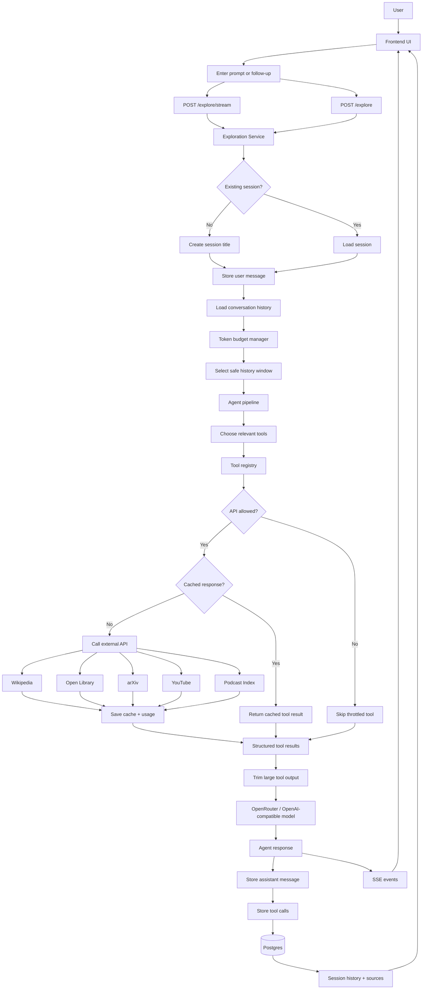
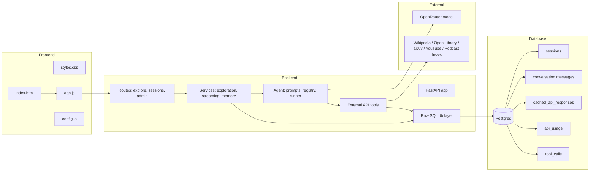

# The Rabbit Hole Workflow

```mermaid
flowchart TD
    User[User] --> Frontend[Frontend UI]
    Frontend --> Prompt[Enter prompt or follow-up]
    Prompt --> StreamEndpoint[POST /explore/stream]
    Prompt --> ExploreEndpoint[POST /explore]

    StreamEndpoint --> Exploration[Exploration Service]
    ExploreEndpoint --> Exploration

    Exploration --> SessionCheck{Existing session?}
    SessionCheck -->|No| CreateSession[Create session title]
    SessionCheck -->|Yes| LoadSession[Load session]

    CreateSession --> StoreUser[Store user message]
    LoadSession --> StoreUser

    StoreUser --> History[Load conversation history]
    History --> TokenManager[Token budget manager]
    TokenManager --> SelectedHistory[Select safe history window]

    SelectedHistory --> Agent[Agent pipeline]
    Agent --> ToolChoice[Choose relevant tools]
    ToolChoice --> Registry[Tool registry]

    Registry --> RateLimit{API allowed?}
    RateLimit -->|No| SkipTool[Skip throttled tool]
    RateLimit -->|Yes| CacheCheck{Cached response?}

    CacheCheck -->|Yes| CachedResult[Return cached tool result]
    CacheCheck -->|No| ExternalAPI[Call external API]

    ExternalAPI --> Wikipedia[Wikipedia]
    ExternalAPI --> OpenLibrary[Open Library]
    ExternalAPI --> Arxiv[arXiv]
    ExternalAPI --> YouTube[YouTube]
    ExternalAPI --> PodcastIndex[Podcast Index]

    Wikipedia --> SaveCache[Save cache + usage]
    OpenLibrary --> SaveCache
    Arxiv --> SaveCache
    YouTube --> SaveCache
    PodcastIndex --> SaveCache

    SaveCache --> ToolResults[Structured tool results]
    CachedResult --> ToolResults
    SkipTool --> ToolResults

    ToolResults --> TruncateTools[Trim large tool output]
    TruncateTools --> LLM[OpenRouter / OpenAI-compatible model]

    LLM --> Response[Agent response]
    Response --> StoreAssistant[Store assistant message]
    StoreAssistant --> StoreTools[Store tool calls]
    StoreTools --> DB[(Postgres)]

    Response --> SSE[SSE events]
    SSE --> Frontend
    DB --> Sessions[Session history + sources]
    Sessions --> Frontend
```

```mermaid
flowchart LR
    subgraph Frontend
        UI[index.html]
        CSS[styles.css]
        JS[app.js]
        Config[config.js]
    end

    subgraph Backend
        Main[FastAPI app]
        Routes[Routes: explore, sessions, admin]
        Services[Services: exploration, streaming, memory]
        AgentCore[Agent: prompts, registry, runner]
        Tools[External API tools]
        DBLayer[Raw SQL db layer]
    end

    subgraph Database
        Postgres[(Postgres)]
        SessionsTable[sessions]
        MessagesTable[conversation messages]
        CacheTable[cached_api_responses]
        UsageTable[api_usage]
        ToolCallsTable[tool_calls]
    end

    subgraph External
        Model[OpenRouter model]
        APIs[Wikipedia / Open Library / arXiv / YouTube / Podcast Index]
    end

    UI --> JS
    JS --> Routes
    Routes --> Services
    Services --> AgentCore
    AgentCore --> Tools
    AgentCore --> Model
    Tools --> APIs
    Tools --> DBLayer
    Services --> DBLayer
    DBLayer --> Postgres
    Postgres --> SessionsTable
    Postgres --> MessagesTable
    Postgres --> CacheTable
    Postgres --> UsageTable
    Postgres --> ToolCallsTable
```
